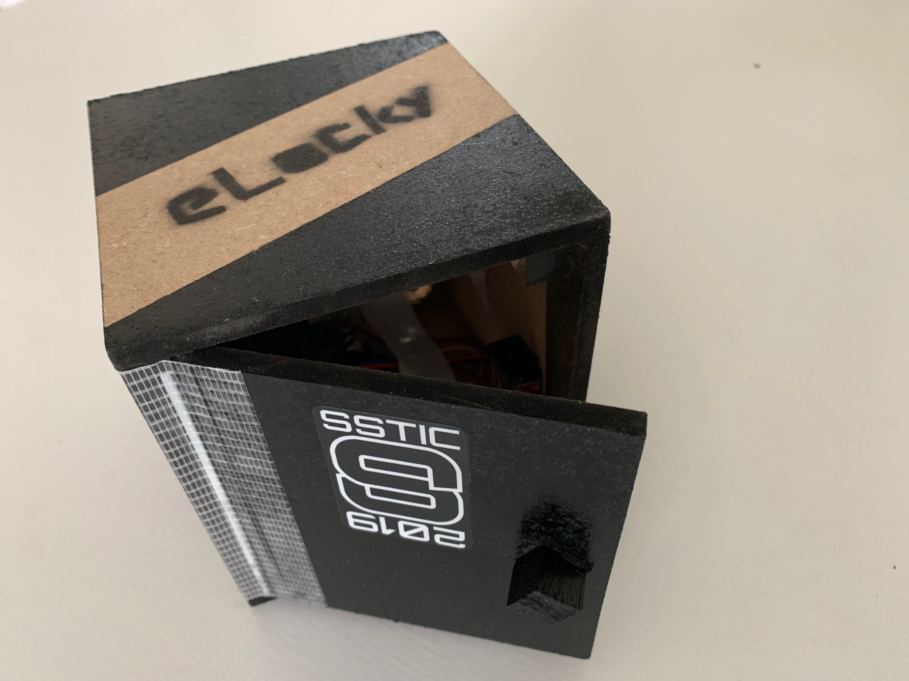
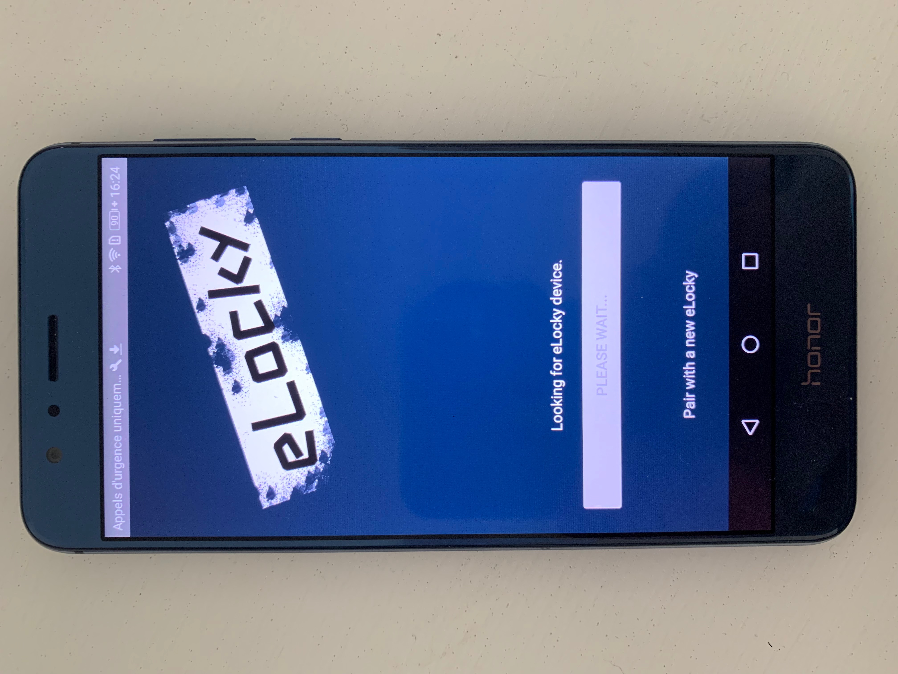
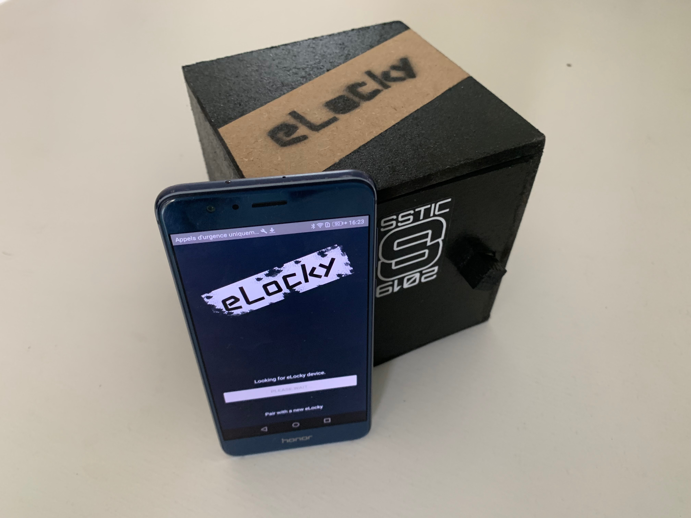

# Chall-IOT-Locker-Android-Client

This IOT Locker has been built for a Cyber-Security challenge.
It is not designed for production purpose because it contains several vulnerabilities. 

This repository contains the source code of the Android application. 
The physical construction plans of the Vault and the Python server code running on the embedded Raspberry Pi will be shared later. 

 
 
 

## Prerequisites

* A fully working Android development environment

## Todo list

* Improve readme file 
* 

## Authors

* **Sylvain Benech** - *Initial work* - [Chuck182](https://github.com/Chuck182)

## License

This project is licensed under the GPL v3 License - see the [LICENSE.md](LICENSE.md) file for details
